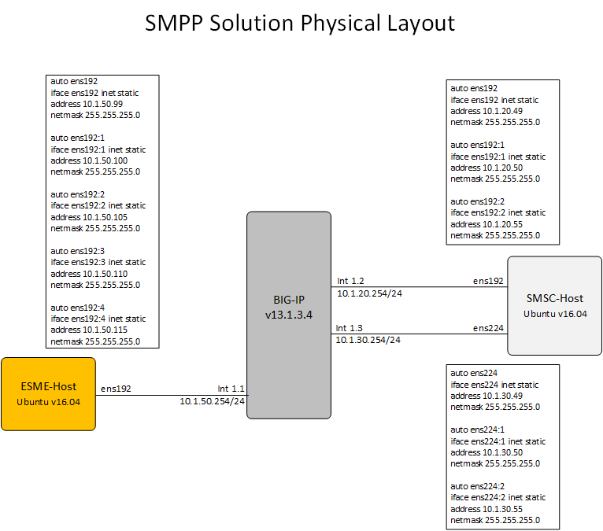
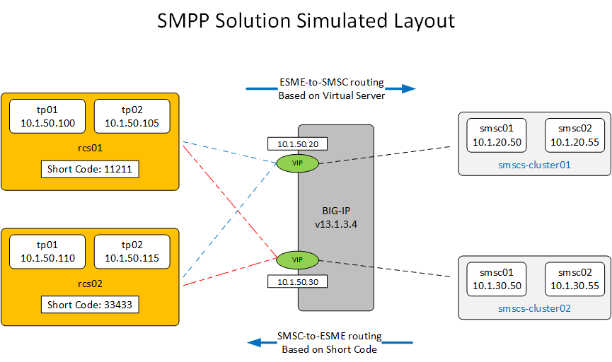

## Building a BIG-IP Short Message Peer-to-Peer Protocol (SMPP) Test / Demo Environment  

### Purpose of this Guide 

This procedure will provide you with step by step instructions for creating a SMPP v3.4 environment (ESME's and SCMS's) and configuring BIG-IP as a message routing proxy for SMPP v3.4.  In this configuration we will configure four simulated SMSC's running on a single SMSC host and 4 simulated ESME's running on a single EMSE host.  The BIG-IP will use generic MRF and iRules to proxy traffic between ESME's and SMSC's.  The iRule also supports short message code routing from SMSC to EMSE's.  The logic for this solution is completely based on generic MRF and iRules.  If you wish to expand the functionality beyond the scope of what is included here you will have to modify the iRules to support that functionality.

   

### Prerequisites/Requirements  

- BIG-IP v13.1.3.4  
- Good understanding of BIG-IP Message Routing Framework (MRF); [Link to MRF Primer](reference_documents/MRF_Explained.docx)  
- Two Ubuntu VM's v16.04  

   

### Technology Overview  

The Short-Messaging Peer-to-Peer Protocol (SMPP) is a family of related protocols for sending messages.  It is generally used for text messaging on 3GPP networks (e.g., LTE).  There are three versions in use: 3.3, 3.4 and 5.0.  In practice, most operators appear to use SMPP 3.4.  Development on SMPP has ceased, and there is currently no curator for the standards.  

   

SMPP 3.4 has two main elements: an External Short Message Entity (ESME, usually pronounced "ez-mee") and a Short Message Service Center (SMSC, usually spelled out, as in "ess - emm - ess - sea").  In general, the ESME is a proxy operating on behalf of actual systems that send and receive messages (e.g., mobile devices), while the SMSC provides endpoint routing, and may also act as a store-and-forward system.  When an SMSC operates in store-and-forward mode, the ESMEs may query the SMSC to determine whether a message has yet been delivered and can cancel messages that are not yet delivered.  EMSEs act as a client and SMSCs act as a server, but messages can flow in either direction, depending on the bind type.  SMPP messages are carried over IP, using TCP for transport.  An ESME always initiates the TCP connection, and when the remote end connects, the ESME sends an SMPP message of the type bind request.  The receiving SMSC responds with a bind response message.  Together, the bind request and response establish an SMPP session between the two peers.  The bind request contains one of the following bind types:  

- transmitter bind - the EMSE will send messages to the SMSC on this transport;  
- bind - the ESME will receive messages from the SMSC on this transport;  
- bind - the EMSE will send and receive messages from the SMSC on this transport.  

As such, an ESME will either open both a transmitter and receiver bound flow toward the SMSC, or the ESME will open a transceiver bound flow toward the SMSC.  

   

SMPP 3.4 is transactional.  The PDU is an SMPP message, and a message is either a request or a response.  A request message should always receive a matching response message.  A request message may be initiated by either an ESME or SMSC.  Each message has a fixed length common header, followed by a message specific header, which is the same for all messages of the same type.  Depending on the message type, this may be followed by zero or more optional headers.  The common header has the following elements:    
1.	Command Length: [4 byes] the total length of the PDU in bytes, including all headers;  
2.	Command Id: [4 bytes] an unsigned 32-bit integer, identifying the SMPP message type.  For any request message type [n], the corresponding response message type is the same value [n], but with the highest order bit set to one.  For example, a bind receiver request message is type 0x00000001, while a bind receiver response message is type 0x80000001;  
3.	Command Status: [4 bytes] a status code, which is set to a non-zero value in response messages only;  
4.	Sequence Number: [4 bytes] a 32-bit unsigned integer which is used to match requests and responses.  When a peer sends a request with sequence number [n], the response from the remote peer must have the same sequence number (i.e., [n]).  

   

The rest of the headers are message type specific.  A few additional headers that are useful to know:
- system_id: in a bind request and bind response, this field provides a name for the peer;
- password: used by an ESME on the bind request to authenticate the ESME;
- service_type: in a submit_sm and deliver_sm message, this indicates the service for which the message is being delivered.  For example, it may indicate WAP (for Wireless Application Protocol) or VMA (for Voice Mail Application).  

   

There are a number of message types, but these are the most useful to know (each has a corresponding response type):
- bind_receiver, bind_transmitter, bind_transceiver: a request to create a bound session over a TCP transport;
- unbind: used to close an SMPP session (transport should be closed afterwards);
- enquire_link: used as a session watchdog message (i.e., to verify that the remote service is still responding);
- submit_sm: the primary SMPP PDU type for carrying text messages from an ESME to an SMSC;
- deliver_sm: the primary SMPP PDU type for carrying text message from an SMSC to an ESME.
 
   

### BIG-IP As a Proxy  

The SMPP 3.4 standard makes no provision for an intermediate proxy between ESMEs and SMSCs.  However, because of the peer-to-peer nature of SMPP, there may be a large number of connections in a mesh of SMPP peers.  This means that the BIG-IP, acting as an intermediate message router, can be useful, both for health detection and to reduce meshing.  However, since the standard doesn't provide for a proxy, the BIG-IP must act like an SMSC on the ESME-facing side and act like an ESME on the SMSC-facing side.  Among other things, this means it must accept and respond to bind requests from the ESMEs, and send bind requests to the SMSCs, processing their responses.  It is possible to proxy binds from one or more ESMEs toward the SMSCs, but it is simpler and more manageable for the BIG-IP to terminate ESME bind sessions, and independently initiate SMSC bind sessions.  

    

Normally, when an ESME delivers a message to an SMSC, the SMSC will either store-and-forward, or it will attempt immediate delivery and provide feedback on success.  An ESME "knows" that it cannot (immediately) deliver a message if it has no active bound sessions toward any SMSC.  When the BIG-IP is acting as a proxy and maintaining independent bind states, the ESME may see an active transport toward what it thinks is an SMSC, but all of the actual SMSCs may in fact be down or otherwise unreachable.  In some way, the ESME must be made aware of this.  There are two strategies:
- Active Bind Signaling: if all SMSCs to which an ESME would normally be bound are "down" (as indicated by monitoring), the BIG-IP active unbinds the ESME and closes the transport.  Similarly, if all ESMEs to which an SMSC would normally be bound are down, the SMSC is unbound by the BIG-IP and the transport is disconnected;
- Per-Message Indication: As described above, response messages have a Command Status.  If the BIG-IP cannot route an incoming message from either an ESME or SMSC, the BIG-IP can generate a matching response (i.e., the response command type matches the request command type, and the response sequence number matches the request sequence number) with an error code indicating that the message cannot be handled.  

The choice of strategy depends on the requirements by the operator and their ESME/SMSC elements.  #1 is substantially more complex than #2.  

    

While L3 (ping) or L4 (tcp/tcp-half-open) monitors can be used, SMPP has an inband monitor watchdog message (the enquire-link).  Using this message request/response pair is a better mechanism.  Because the implementation for SMPP on BIG-IP uses the Generic MRF personality, there is no built-in way to utilize the enquire-link method.  However, it can relatively easily be used in conjunction with an external monitor that injects the messages.  

    

The BIG-IP can either use per-message load-balancing, or via additional iRules, it can perform selective routing (based on SMPP message field values, for example) and persistence (also based on SMPP message values, for example).  

    

### Solution Environment  

The solution simulates up to four ESMEs, organized into two clusters, and up to four SMSCs, organized into two clusters.  The simulated ESME's are running on a single Ubuntu server called ESME-Host.  The simulated SMSC's are running on a single ubunut server called SMSC-Host.  The ESME clusters are called “rcs” clusters.  This is because the PoC upon which this solution was built routed messages between Rich Communications Servers (RCS) acting as ESMEs toward several geographically distinct groups of SMSCs.  

    

  

    

  

    

If an ESME sends an SMPP message to a transport bound to the top Virtual Server, then it is delivered to the cluster01 SMSC pool.  If an ESME sends an SMPP message to a transport bound to the bottom Virtual Server, then it is delivered to the cluster02 SMSC pool.

If an SMSC sends a submit-sm message with the destination_addr field set to one of the two pre-defined short codes, then the message is routed to the “pool” of ESMEs bound to that short code (e.g., if the destination_addr field is 33433, it will be delivered to one of the ESMEs in rcs02).  This is a pseudo-pool, because BIG-IP cannot create a pool with client peers.  The pool is defined in a data-group.

This demo utilizes an SMPP test harness called smppth.  It is open-source and is hosted in a github repository.  smppth is designed for building custom test harnesses but provides a default application – smpp-test-harness – which this solution uses.  smpp-test-harness provides a terminal UI.  One instance is run on the smscs host instance and manages all of the SMSC agents.  Another instance is run on the esmes host instance and manages all of the ESME agents.

    

## Next Step  
[Building out the SMSC and EMSE Servers](procedures/Building_out_SMSC_and_ESME.md)

